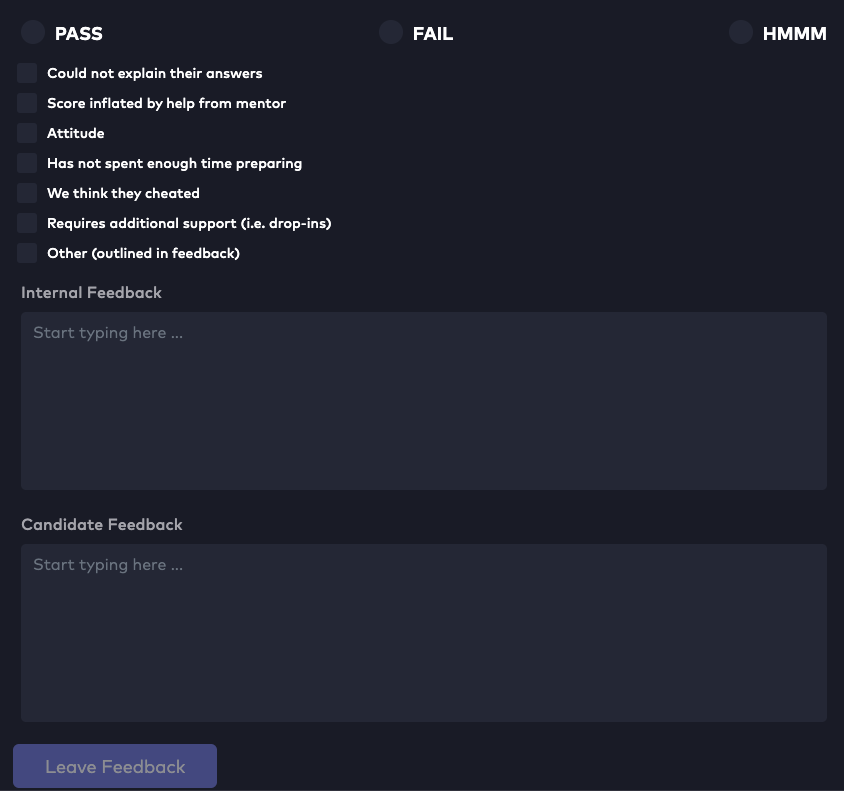
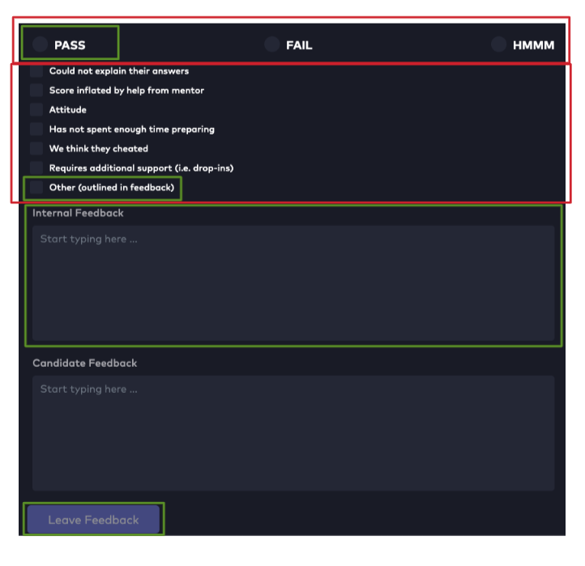

# Atomic Design and Storybook

### Learning Objectives

- Understand what is meant by FE design systems
- Learning about the Atomic Design system
- Understand the impact of tools such as Storybook within design systems

## Design Systems

What is a `design system`?

Have you ever designed a button on your website?

Does it look nearly the same as other buttons?

But have slightly different functionality?

How many of these buttons could be written across the scope of a whole application?

This could be problematic for a number of reasons but let's hone in on the big one. This code is not `DRY` and having a number of nearly identical buttons with similar behaviour can be difficult to debug and even more difficult to scale. Most FE frameworks (looking specifically at you React) are designed with `reusable components` in mind.

Enter a design system. A design system is an `infrastructure` that focusses on UI patterns to enable FE developers consider the composition of an app, how accessible it may be and how components can be reused. It has no care for data fetching or complicated configuration or secrets. The focus is on `isolating UI components`, building components that can be hydrated via props or context for the purposed of development and then slotted into a main application once ready. This keeps development encapsulated and can protect against too many requests being made.

However, design systems can be difficult to implement. There can be confusing terminology and ideas about how to design the system and there may not be the appropriate tools available. A solution we'll take a look at is the Atomic Design implemented via Storybook.

## Atomic Design

So, what's the point of `Atomic Design` (other than to lead into an Atomic by Blondie sing-a-long!)?

Atomic Design is a design is a design system that allows us to describe the different kinds of UI components in terms of complexity.

Let's take the following form and break it down in to components following Atomic Design.

1. `Atoms`

As you can probably guess, atoms comprise of the smallest components with the least complex behaviour. Ideally, data from third party sources would go nowhere near our atoms.

Atoms should be `small reusable components`. Below are the atom components from this form highlighted in green.

These are all individual components of a radio button, checkbox and inputs (all with corresponding labels/text) and a call to action button. All of which can consume hard coded data or that passed via props or context. All have the ability to be reusable across the whole application.

2. Molecules

Molecules are a sensible `collections of atoms`. Often this can be seen where we use multiple of the same atom like below highlighted in red.These groupings enable dynamic sections of the larger form.

This may not always be the case. Molecules group atoms together by functionality or likeness but there may still not be enough complexity for a piece of user functionality to be completed.

Which brings us to ....

3. Organisms

Organisms embody a piece of user functionality. For example the whole of the feedback form, the ability to select options and write text but also, crucially, leave the feedback too. `Organisms can comprise of both atoms and molecules`, dependent on how the components can be grouped.

## Storybook

So ... we have our system in place, now we just need to a tool to be able to implement it.

Traditionally, when we build FE apps, we build on a page by page basis, adding components and complexity as they arise from the perspective of a user journey. This can be a cumbersome developer experience, _especially_ when applications grow and become complex.

Storybook is a tool that will allow us to build our components in isolation and view outside of the context of a whole application.

In order to do this we provide each component with a separate `story` component. This is how we can view the component via Storybook but also hydrate with all of the different kinds of data we might use to customise our component. Now we are able to create our components with the UI in mind, without worrying about BE calls or data fetching until we require them.
